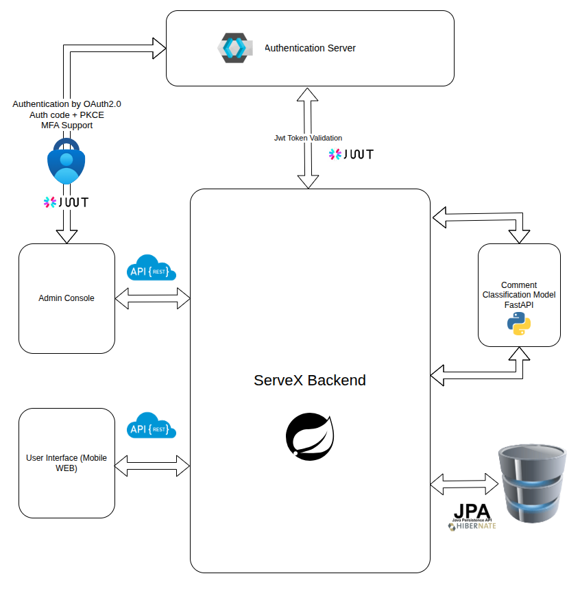

# ServeX Review Categorizer

ServeX Review Categorizer is a lightweight FastAPI service that classifies restaurant reviews into Good, Bad, Complain, or Suggestions using keyword-based scoring with priority rules. It exposes a simple REST API for health checks and real-time review categorization

This project is built for **learning + practical industry alignment**, not as a toy CRUD demo.

---

## 🖼️ System Architecture



The system follows a **decoupled, service-oriented architecture** with external authentication and an independent AI service.

---

## 🧩 Architecture Overview

### 🔐 Authentication Server
- Implements **OAuth 2.0 Authorization Code Flow with PKCE**
- Supports **Multi-Factor Authentication (MFA)**
- Issues **JWT tokens**
- Centralized identity provider
- ServeX backend never stores or handles user passwords

---

### 🧠 ServeX Backend (Spring Boot)
- Core backend service
- Stateless REST API
- Validates JWT tokens issued by the Authentication Server
- Handles all business logic related to:
  - Customers
  - Orders
  - Order details
  - Menu items
  - Tables
  - Reviews
- Communicates with:
  - AI Comment Classification Service
  - Relational database via JPA/Hibernate

This is the **central brain** of the system.

---

### 🧑‍💼 Admin Console
- Used by restaurant admins and staff
- Communicates with ServeX Backend via REST APIs
- Secured using JWT authentication
- Typical use cases:
  - Manage menu items
  - Monitor and manage orders
  - View customer feedback

---

### 📱 User Interface (Mobile / Web)
- Customer-facing frontend
- Uses REST APIs exposed by ServeX Backend
- Authenticated via OAuth2 + JWT
- Typical use cases:
  - Place orders
  - Submit reviews
  - Track order status

---

### 🤖 Comment Classification Service (FastAPI + Python)
- Independent AI microservice
- Built using **FastAPI**
- Receives customer reviews from ServeX Backend
- Classifies comments into categories such as:
  - Good
  - Bad
  - Complaint
  - Suggestion
- Returns classification results back to the backend
- AI logic is fully decoupled from the Java backend

This separation avoids tight coupling and keeps the backend clean.

---

### 🗄️ Database Layer
- Relational database (MySQL / PostgreSQL)
- Accessed via **JPA/Hibernate**
- Stores:
  - Customers
  - Orders
  - Order details
  - Menu items
  - Tables
  - Reviews

---

## 🚀 Features

- RESTful API design
- Secure JWT-based request validation
- OAuth 2.0 authentication with PKCE
- Modular controller structure
- AI-powered review classification
- Clean separation of concerns
- Frontend-ready API endpoints

---

## 🧱 Tech Stack

**Backend**
- Java 17+
- Spring Boot
- Spring Web (REST APIs)
- Maven
- JPA / Hibernate

**AI Service**
- Python
- FastAPI

**Security**
- OAuth 2.0
- JWT
- PKCE
- MFA (via Authentication Server)

**Database**
- MySQL / PostgreSQL

---

## 📂 Controller Structure

### Core Controllers
- `CustomerController`
- `RestaurantController`
- `ItemController`
- `TableController`
- `OrderController`
- `OderDetailController`
- `ReviewController`

### UI-Specific Controllers
- `UiOrderController`
- `UiReviewController`
- `UiStreamController`

UI controllers exist to **avoid polluting core APIs** with frontend-specific logic.

---

## 🔐 Security Flow (High-Level)

1. User/Admin authenticates via Authentication Server
2. Authentication Server issues a JWT token
3. Client sends JWT with API requests
4. ServeX Backend validates the token
5. Authorized request is processed
6. Response is returned to the client

No token → no access.

---

## ▶️ Running the Project

```bash
mvn clean install
mvn spring-boot:run
The backend will start on:

arduino
Copy code
http://localhost:8080
🧪 API Testing
Use Postman or Swagger UI

JSON-based request and response bodies

REST-compliant HTTP methods (GET, POST, PUT, DELETE)

🎯 Project Purpose
This project was created to:

Practice real-world Spring Boot backend architecture

Learn secure API design with OAuth2 and JWT

Integrate AI services using microservice principles

Prepare for industry-level backend development

This system is not production-ready without:

Full validation

Global exception handling

Rate limiting

Logging & monitoring

And that’s intentional.

🔮 Future Improvements
Spring Security integration inside backend

Role-based access control (ADMIN, WAITER, KITCHEN)

WebSocket-based real-time updates

DTO mapping with MapStruct

Pagination and filtering

API documentation with OpenAPI / Swagger

Dockerized deployment

👤 Author
Induma Wijesinghe
Backend-Focused Full Stack Developer

Spring Boot • .NET • REST APIs • SQL • Docker • OAuth2 • JWT • AI Integration
